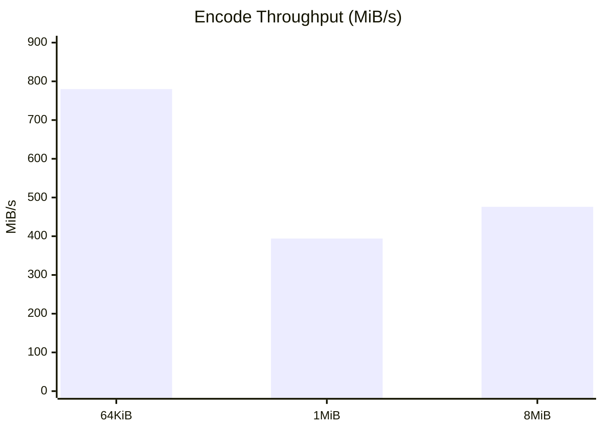

# Oxidelta Announcement Draft

## Oxidelta 0.1.0

We are releasing **Oxidelta**, a production-focused Rust implementation of VCDIFF (RFC 3284) for delta patch generation and application.

## Why Oxidelta

- Rust-native library and CLI
- Strong test coverage (unit, integration, property tests)
- Interop validation against xdelta3
- Modern CI/release automation and cross-platform binary publishing

## Feature Comparison

| Capability | xdelta3 | Oxidelta |
|---|---|---|
| Core VCDIFF encode/decode | Yes | Yes |
| LZMA secondary compression | Yes | Yes |
| Zlib secondary compression extension | No | Yes |
| Rust library API | No | Yes |
| Idiomatic subcommand CLI | No | Yes |
| Cross-platform release automation | Varies by downstream | Built-in via GitHub Actions |

## Performance Snapshot

Benchmark reference: `PERFORMANCE.md`



Sample encode latency comparison (1 MiB workload):

- Oxidelta: ~1.374587 ms
- xdelta3: ~1.580913 ms

## Migration

For xdelta CLI users:

- Migration guide: `MIGRATION.md`
- Workflow conversion script: `scripts/migrate-from-xdelta.sh`

Example:

```bash
xdelta -e -s old.bin new.bin patch.vcdiff
# becomes
oxidelta encode --source old.bin new.bin patch.vcdiff
```

## Install

```bash
cargo install --locked oxidelta
```

Prebuilt binaries for Linux, macOS, and Windows are published in GitHub Releases.
